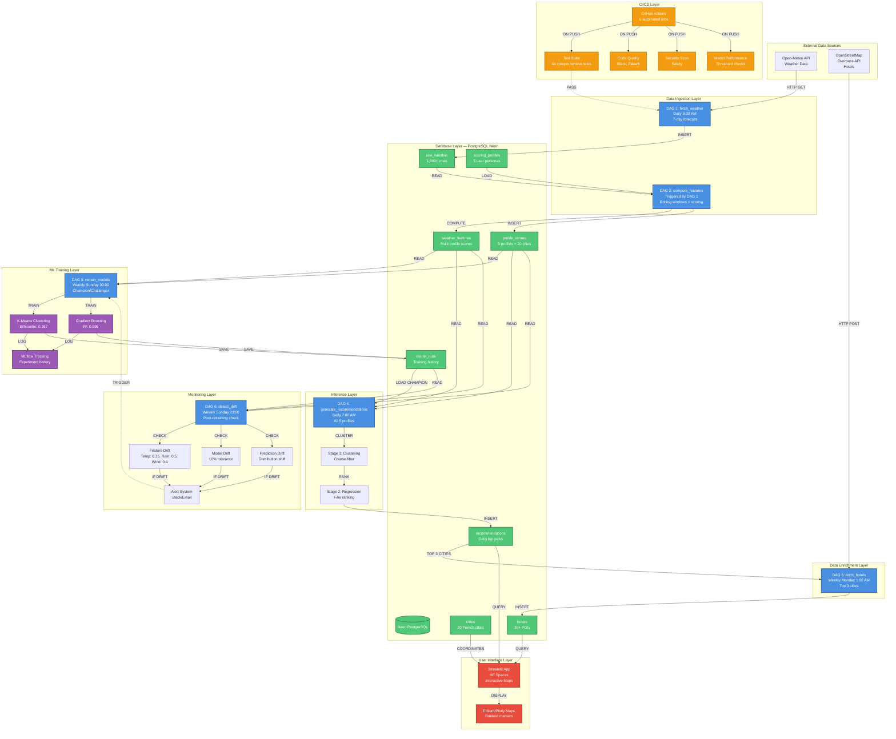

# France Weather Recommender — System Architecture

## Overview Diagram



## Detailed Component Breakdown

### 🔄 Data Pipeline (DAGs 1-2)
**Daily Execution Flow:**
```
06:00 → DAG 1 fetches 7-day forecast for 20 cities
06:05 → DAG 2 triggered automatically
06:05 → Computes rolling windows (7-day, 3-day)
06:06 → Computes comfort scores for ALL 5 profiles
06:07 → Inserts ~100 profile_score records (20 cities × 5 profiles)
```

**Outputs:**
- `weather_features`: temp_mean_7d, temp_mean_3d, precip_sum_7d, precip_sum_3d, wind_max_7d, wind_max_3d
- `profile_scores`: Leisure: 67.0/100, Wind Sports Enthusiast: 83.8/100, Cyclist: 30.5/100, etc.

---

### 🤖 ML Training Layer (DAG 3)
**Weekly Execution Flow:**
```
Sunday 00:00 → Load last 90 days of features
Sunday 00:01 → Train K-Means (k=4)
Sunday 00:02 → Train Gradient Boosting
Sunday 00:03 → Log to MLflow
Sunday 00:04 → Champion/Challenger comparison
Sunday 00:05 → Promote if better (R² +0.01 or Silhouette +0.05)
```

**Models:**
- **K-Means:** 4 clusters, silhouette=0.367
- **Gradient Boosting:** R²=0.995, RMSE=0.92, Feature importance: Precip 77%, Temp 19%, Wind 4%

**Champion/Challenger Logic:**
```
IF new_r2 > champion_r2 + 0.01:
    promote_to_champion()
    demote_old_champion()
ELSE:
    keep_current_champion()
```

---

### 🎯 Inference Layer (DAG 4)
**Two-Stage Retrieval:**
```
Stage 1: K-Means Clustering (Coarse Filter)
├─ Cluster 20 cities into 4 weather profiles
├─ Rank clusters by comfort (Mediterranean > Atlantic > Continental)
└─ Keep cities in top 2 clusters

Stage 2: Regression Scoring (Fine Ranking)
├─ Predict comfort scores for filtered cities
├─ Rank by score (highest first)
└─ Assign ranks 1-N per profile
```

**Output:**
- `recommendations`: 5 profiles × ~8 cities each = ~40 records/day
- Example: (2026-02-19, Nice, leisure, cluster=2, score=67.0, rank=1)

---

### 🏨 Data Enrichment (DAG 5)
**Weekly Execution Flow:**
```
Monday 01:00 → Query recommendations for top 3 cities
Monday 01:01 → Overpass API: Search hotels within 10km radius
Monday 01:02 → Filter to top 10 hotels per city (by stars)
Monday 01:03 → Insert ~30 hotels total
```

**Hotel Filtering:**
- ✅ hotel, guest_house, apartment types
- ✅ Sort by: stars DESC, then alphabetical
- ✅ Limit: 10 per city
- ❌ Exclude: hostels (unless user wants budget)

---

### 📊 Monitoring Layer (DAG 6)
**Drift Detection Strategy:**

**Adjusted Thresholds (Production-Tuned):**
```python
DRIFT_THRESHOLDS = {
    # Feature drift (K-S test)
    'temp_mean_3d':   0.35,  # Seasonal changes expected
    'precip_sum_3d':  0.50,  # Natural spikiness in rain
    'wind_max_3d':    0.40,  # Moderate variation
    
    # Model performance drift
    'performance_drop': 0.10,  # 10% tolerance for noise
    
    # Mean shift (std deviations)
    'feature_shift': 2.0,  # 2 sigma rule
}
```

**Why These Thresholds:**
- **Temperature (0.35):** Winter→Summer can shift 10°C+, need tolerance
- **Precipitation (0.50):** Rain is binary (rainy days vs dry spells)
- **Wind (0.40):** Coastal vs inland variance
- **Performance (10%):** R²: 0.995→0.895 still acceptable, avoid noise alerts

**Weekly Execution Flow:**
```
Sunday 23:00 → Compare current week vs 4-week baseline
Sunday 23:01 → Run K-S tests on features
Sunday 23:02 → Check model performance (R², silhouette)
Sunday 23:03 → Check prediction distributions
Sunday 23:04 → Generate drift report
Sunday 23:05 → Send alerts IF drift detected
Sunday 23:06 → (Optional) Trigger DAG 3 retraining
```

**Drift Decision Tree:**
```
IF ks_statistic > threshold:
    IF mean_shift > 2.0:
        severity = CRITICAL → Retrain immediately
    ELSE:
        severity = MAJOR → Alert, schedule retraining
ELSE IF performance_drop > 0.10:
    severity = MAJOR → Retrain next cycle
ELSE:
    severity = NONE → Continue monitoring
```

---

### 🎨 User Interface (Streamlit on HF Spaces)
**Features:**
- Profile dropdown: 🏖️ Leisure, 🏄 Wind Sports Enthusiast, 🚴 Cyclist, ⭐ Stargazer
- Interactive map: Folium/Plotly with ranked markers
- City cards: Weather metrics + top 5 hotels
- Model metrics: Current champion R² + silhouette
- Date selector: Historical recommendations

**Technology Stack:**
- Streamlit 1.28+ (UI framework)
- Plotly (interactive maps, better HF Spaces compatibility)
- Neon PostgreSQL (live data queries)
- Deployed: Hugging Face Spaces (public)

---

### 🔧 CI/CD Pipeline (GitHub Actions)
**6 Automated Jobs:**

1. **🧪 Test Suite**
   - 44 comprehensive tests (drift, features, models)
   - Complete ML pipeline validation
   - Tests: unit, integration, statistical methods

2. **🎨 Code Quality**
   - Black (formatting)
   - Flake8 (linting)
   - isort (import sorting)

3. **🔒 Security Scan**
   - Safety check for CVEs
   - Dependency vulnerability scanning

4. **📊 Model Performance**
   - Train on synthetic data
   - Verify R² > 0.75
   - Verify silhouette > 0.3

5. **🚀 Deploy**
   - Only on main branch
   - Only if tests pass
   - Automated deployment pipeline

6. **📢 Notify**
   - On failure only
   - Would send Slack/email in production

**Trigger:** Every push to main or PR

**Workflow:**
```
git push → GitHub Actions
  ├─ [Parallel] Test + Lint + Security
  ├─ [Sequential] Model Performance
  ├─ [If Pass] Deploy
  └─ [If Fail] Notify
```

---

## 📈 System Metrics

**Scale:**
- **Cities:** 20 French destinations
- **Profiles:** 5 user personas
- **Daily Records:** ~100 (20 cities × 5 profiles)
- **Weekly Hotels:** ~30 (top 3 cities × 10 hotels)
- **DAG Runs:** 6 DAGs × weekly = ~40 executions/week
- **Test Suite:** 44 comprehensive tests
- **CI/CD Jobs:** 6 per commit

**Performance:**
- **API Latency:** Open-Meteo: <500ms, Overpass: 1-2s
- **DAG Duration:** DAG 1: 30s, DAG 2: 45s, DAG 3: 2min, DAG 4: 30s, DAG 5: 45s, DAG 6: 30s
- **Model Training:** K-Means: 15s, Regression: 45s
- **Batch Inference:** 20 cities × 5 profiles in <30s

**Reliability:**
- **Idempotent Writes:** ON CONFLICT DO UPDATE (no duplicate rows)
- **Error Handling:** Per-city try/catch (one failure doesn't kill DAG)
- **Retries:** Airflow retries=1, retry_delay=5min
- **Monitoring:** Drift detection weekly, alerts on threshold breach

---

## 🎯 MLOps Best Practices Demonstrated

✅ **Orchestration:** Airflow DAGs with dependencies  
✅ **Feature Engineering:** Separate DAG (reproducibility)  
✅ **Experiment Tracking:** MLflow with full lineage  
✅ **Model Versioning:** Champion/Challenger with Git SHA tags  
✅ **Automated Testing:** 44 comprehensive tests in CI/CD  
✅ **Monitoring:** Feature drift + model drift + prediction drift  
✅ **Deployment:** Automated via CI/CD on main branch  
✅ **Infrastructure as Code:** Docker Compose, GitHub Actions YAML  
✅ **Documentation:** README, code comments, architecture diagrams  

---

## 🔮 Future Enhancements (Post-Exam)

**Phase 4: Real-Time API**
- FastAPI endpoint for on-demand recommendations
- Redis caching for low latency (<100ms)
- Rate limiting per user

**Phase 5: Advanced Monitoring**
- Grafana dashboards (drift trends, model performance)
- DataDog APM integration
- PagerDuty alerts for critical drift

**Phase 6: Scale-Up**
- Kubernetes deployment (replace Docker Compose)
- Horizontal pod autoscaling
- 100+ cities across Europe

**Not Needed Yet:**
- Feature store (scale too small)
- Model explainability (SHAP) — nice-to-have
- A/B testing framework (Champion/Challenger sufficient)

---

Built by Aga for AI Architect Certification — February 2026
